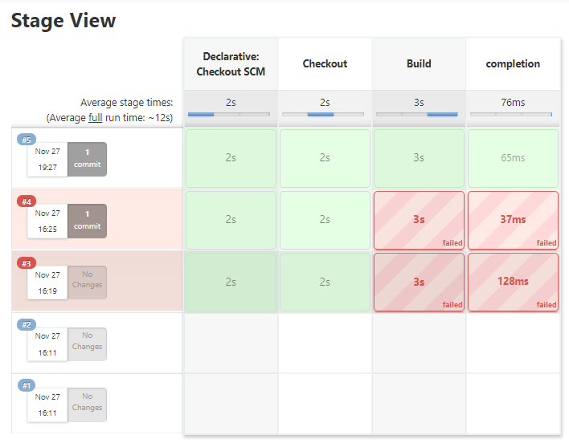

<h1 align = "center">
	Hello Jenkins  
	
	
	
	
	
	
	
	 
</h1>

A <b><code>hello-world</code> jenkins</b> pipeline built for python code. Jenkins is a open-source automation software, and unlike other CI tools, it needs an elaborate setup! I've primarily used <a href = "https://linuxmint.com/"><b>Linux Mint 20.2</b> Cinnamon</a> for setting up my workspace environment. Steps to configure and install Jenkins is available <a href = "https://stackoverflow.com/questions/70107177/">here</a>. After some trial-and-error, the stage view for the current job looks like:

